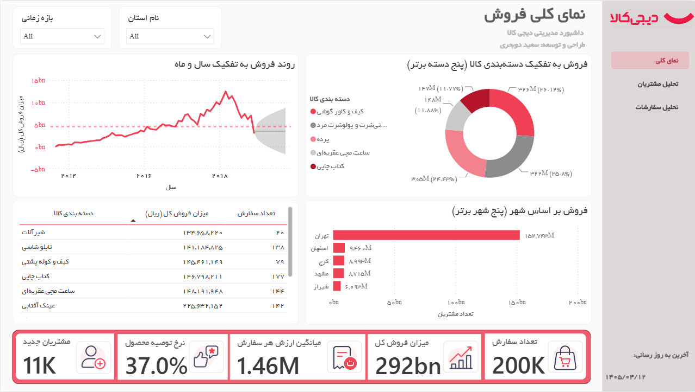

## داشبورد تحلیل دیجی‌کالا

داشبورد جامع Power BI بر پایه داده‌های واقعی دیجی‌کالا که با هدف تحلیل عملکرد فروش، رفتار مشتری، عملکرد محصولات، رضایت مشتری و شاخص‌های لجستیکی طراحی شده است.

## درباره پروژه

این پروژه نمونه‌ای از یک فرآیند کامل Business Intelligence است که شامل مراحل زیر می‌شود:

- طراحی مدل داده به روش Star Schema
- پاک‌سازی و تبدیل داده‌ها با Power Query
- طراحی معیارها و محاسبات پیشرفته با DAX
- طراحی داشبوردهای مدیریتی و تحلیلی
- تحلیل رفتار مشتری با مدل RFM
- تحلیل جغرافیایی سفارش‌ها

## صفحات داشبورد

### ۱. نمای کلی مدیریتی

شاخص‌های کلیدی عملکرد و روند درآمد برای تصمیم‌گیری مدیریتی.

* ارزش ناخالص کالا (GMV)
* مشتری فعال: مشتریانی که در 90 روز اخیر (نسبت به آخرین تاریح موجود در داده ها) خرید داشته اند
* میانگین ارزش سبد خرید (AOV)
* نمودار روند فروش با پیش بینی سه ماهه
* پنج دسته برتر محصولات
- نرخ توصیه محصول

### ۲. تحلیل مشتریان

دسته‌بندی مشتریان بر مبنای رفتار خرید بر اساس مدل RFM 

- تازگی (Recency):\*\* تعداد روز از آخرین خرید نسبت به آخرین تاریخ در داده 

- تکرار (Frequency):\*\* تعداد سفارش‌های متمایز هر مشتری

- ارزش مالی (Monetary):\*\* مجموع خرید هر مشتری

### 3. تحلیل سفارشات 

تحلیل مکانی توزیع سفارش‌ها در شهرهای ایران.

- نقشه پُرشده و نقشه حبابی: حجم سفارش و GMV به تفکیک شهر

- ۱۵ شهر برتر بر اساس تعداد سفارش و درآمد

- تمرکز محصولات دسته A به تفکیک شهر (برای برنامه‌ریزی انبار)

## منابع داده

داده‌ها از مجموعه داده‌های عمومی دیجی‌کالا تهیه شده‌اند.

## درباره من

سعید دوبحری

تحلیلگر داده با تمرکز بر هوش تجاری، تحلیل فضایی و تحلیل داده‌های بازار ایران.

این پروژه صرفا برای اهداف آموزشی و نمونه کار منتشر شده است. 

مالکیت داده‌ها متعلق به صاحبان اصلی آن‌هاست.

